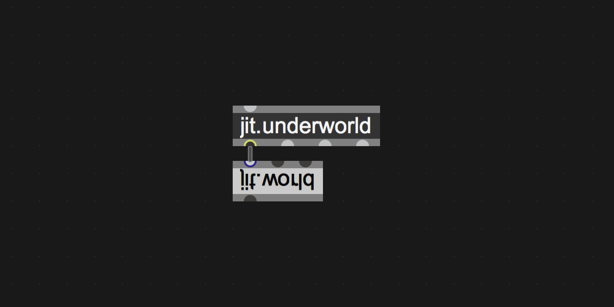

# jit.underworld

Gateway to non-realtime HiRes rendering with jit.world in Cycling74's Max



# About

Gateway to non-realtime HiRes rendering of jitter visuals. The rendering process has three steps. 

- `realtime` : First you set the mode to (realtime), allowing normal jitter processes and rendering, use this to patch like usual and create your generative processes and controller mappings. 

- `capture` : Then start (capture) to gather all controller, signal and data-streams on a per-frame basis (with framecount) into a dictionary. Switch to (realtime) to stop the capturing, or send a message (stop). Use the jit.acheron~ to record your sound along with the capturing in real time.

- `render` : The final stage is the (render). Starting the render will reset the framecount to 0, start rendering the visuals on the set resolution (dim), and record to [jit.record] with the settings (fps), (codec) and (engine). For every frame it will gather the capture data and apply to the visuals.

# Objects

- `jit.underworld` : *the non-realtime rendering for jit.world*
- `jit.hades~` : *capture signals per frame*
- `jit.persephone` : *capture data (int/float/list/symbols) per frame*
- `jit.charon` : *capture jitter matrices per frame*
- `jit.acheron~` : *record audio on capture start to soundfile*

## jit.underworld

The main object that works together with the `jit.world` object to create a non-realtime rendering option.

**arguments**
- context name : the jit.world context name (required)
- name : name your jit.underworld context and use this for all your jitter objects in the patch. (required)

**attributes**
- `@fps` - the frames per second for data/signal capture and offline rendering (default=60)
- `@dim` - the rendering resolution x/y (default=480 270)
- `@render_dim` - the preview resolution in the jit.world (default=1920 1080)
- `@codec` - recording code (h264, prores, huffyuv, gif, jpeg, default=prores)
- `@engine` - recording engine (viddll, hap, avf, qt, default=viddll)

**messages**
- `realtime` - use jitter in realtime, as usual
- `capture` - start capturing the data/signal/matrix streams to dictionary or matrixset per frame
- `render` - offline render the captured data/signal/visual to disk
- `goto` - view a specific frame
- `rewind` - rewind framecount to 0 (stop/realtime also rewind)
- `endtime` - automatically stop the rendering and capturing after this time (mm ss ms)
- `messages` - set attributes via messages

## jit.hades~

jit.hades~ will gather the signal data that comes in and store it in a dictionary per frame for you to take with you to the jit.underworld and allow for non-realtime rendering later on.

**arguments**
- context name : use the name of your jit.underworld context
- parameter name : set a custom parameter name for referring when capturing (optional, if none it will use a random number)

**attributes**
- `@capture` - enable/disable the capturing for this object when you run the capture message on jit.underworld.

**messages**
- `signal` - capture incoming signal or throughput in realtime mode. Signals will be converted to `float` via snapshot per render bang.
- `messages` - set attributes via messages
## jit.persephone

The spouse of jit.hades~. Captures all "regular" data per rendering frame. This can be `int`'s, `float`'s, `list`'s or `symbol`'s. All will be stored in the dictionary for non-realtime rendering.

**arguments**
- context name : use the name of your jit.underworld context
- parameter name : set a custom parameter name for referring when capturing (optional, if none it will use a random number)

**attributes**
- `@capture` - enable/disable the capturing for this object when you run the capture message on jit.underworld.
- `@change` - set to 1 if you only want values to output on changes
- `@zlmaxsize` - set the max listlength (default is 256)

**messages**
- `int` `float` `list` `symbol` - capture incoming data or throughput in realtime mode
- `messages` - set attributes via messages

## jit.charon

The ferryman of the underworld. Captures all jit.matrix input per rendering frame. All will be stored in a dynamic matrixset build in js for non-realtime rendering.

**arguments**
- context name : use the name of your jit.underworld context

**attributes**
- `@capture` - enable/disable the capturing for this object when you run the capture message on jit.underworld.

**messages**
- `jit_matrix` - capture incoming matrix or throughput in realtime mode
- `messages` - set attributes via messages

## jit.acheron~

jit.acheron~ is a multichannel recording abstraction that starts recording the received sound to a file on your disk in real time. It starts its recording at the moment you start to `capture` signals and parameters for the frame-timeline to allow for tight synchronisation after the rendering process is completed and you manually combine the video with the soundrecording.

**arguments**
- context name : use the name of your jit.underworld context
- channel count: how many channels should be recorded

**attributes**
- `@capture` - enable/disable the recording when you run the capture message on jit.underworld.

**messages**
- `multichannelsignal` - input a mc-signal to record
- `messages` - set attributes via messages

## Merging sound and video with ffmpeg

You can use any video editting software to add the video to the soundfile like iMovie, Davinci Resolve, Shotcut and more. But you can also use the commandline. If you have [`ffmpeg`](https://ffmpeg.org/download.html) installed use the following command:

```
$ ffmpeg -i movie.mov -i sound.wav -map 0:v -map 1:a -c:v copy -shortest output.mov
```

This line maps the movie of file 1 (`-map 0:v`) and the audio of file 2 (`-map 1:a`) into a new file (`output.mov`) where the total length is based on the shortest file (`-shortest`).
# Install

Download zip
```
1. download zip
2. unzip and place in Max Searchpath (eg. MacOS ~/Documents/Max 8/Library)
3. restart Max8
```
Git clone
```
1. $ cd ~/Documents/Max\ 8/Library
2. $ git clone https://github.com/tmhglnd/jit.underworld.git
3. restart Max8
```
```
4. Create a new object with "n" and type jit.underworld. Alt + Right-click to open the helpfile.
5. Read the helpfile for a detailed description.
```

# License

The MIT License
